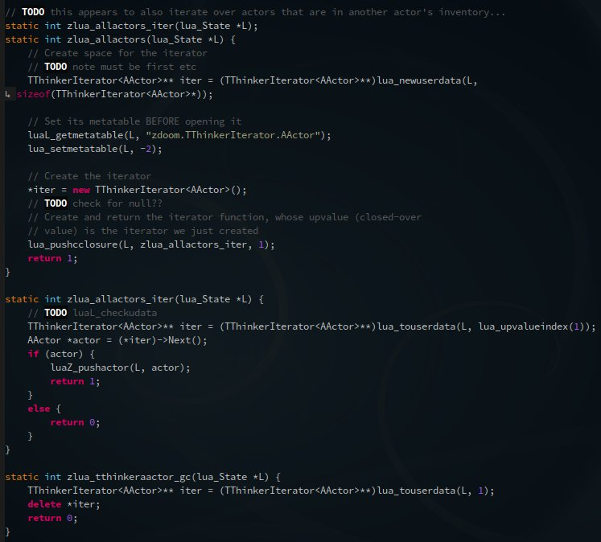
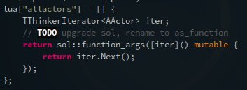

mentions
========
so does anyone cool use this thing...?
--------------------------------------

Okay, so the features don't convince you, the documentation doesn't convince you, you want to see what *other* people think about Sol? Well, aside from the well-wishes that come through in the issue tracker, here's a few things floating around about sol2 that I occasionally get pinged about:

`eevee`_ demonstrating the sheer code reduction by using sol2:

+----------+---------+
| |before| | |after| |
+----------+---------+

* (CppNow) sol2 was mentioned in a comparison to other scripting languages by ChaiScript developer, Jason Turner (@lefticus), at a conference!
	- https://github.com/lefticus/presentations/blob/master/HowAndWhyToAddScripting.md
* (CppCast) Showed up in CppCast with Elias Daler!
	- https://eliasdaler.github.io/cppcast#read-more
	- http://cppcast.com/2016/07/elias-daler/
* (Eevee) A really nice and neat developer/artist/howaretheysotalented person is attempting to use it for zdoom!
	- https://eev.ee/dev/2016/08/07/weekly-roundup-three-big-things/
* (Twitter) Twitter has some people that link it:
	- https://twitter.com/eevee/status/762039984085798913
	- https://twitter.com/thephantomderp/status/762043162835709952
	- https://twitter.com/EliasDaler/status/739082026679173120
	- https://twitter.com/racodslair/status/754031870640267264
* (Reddit) Posts on reddit about it!
	- https://www.reddit.com/r/cpp/comments/4a8gy7/sol2_lua_c_binding_framework/
	- https://www.reddit.com/r/cpp/comments/4x82hd/plain_c_versus_lua_libraries_benchmarking_speed/
* Somehow landed on a Torque3D thread...
	- http://forums.torque3d.org/viewtopic.php?f=32&t=629&p=5246&sid=8e759990ab1ce38a48e896fc9fd62653#p5241

`Tell me about your uses!`_

Are you using sol2 for something neat? Want it to be featured here or think it's unfair that ThePhD hasn't found it yet? Well, drop an issue in the repo or send an e-mail!

.. _Tell me about your uses!: https://github.com/ThePhD/sol2/issues/189
.. _eevee: https://twitter.com/eevee