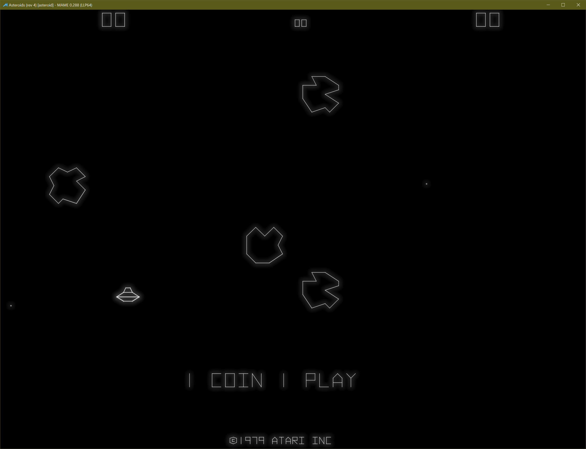
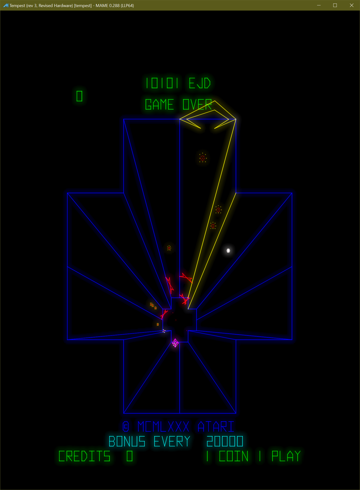

BGFX vector CRT renderer
========================

.. contents:: :local:

Purpose and status
------------------

The BGFX vector CRT renderer is a GPU pipeline for MAME vector games.  It
replaces direct, frame-oriented line drawing with a persistent HDR phosphor
buffer, instanced Gaussian beam deposition, approximate scan-order timing,
bloom, and tone-mapped composition.

Set the ``bgfx_vectorcrt`` option to ``1`` to enable it.  The option is disabled
by default.  The renderer is used only with the BGFX video backend and when the
primitive list contains a vector-buffer marker.  If its effects, geometry, or
RGBA16F render targets cannot be created, BGFX falls back to normal vector line
rendering.

Source map
----------

The implementation is split across these locations:

* ``src/osd/modules/render/bgfx/vectorrenderer.cpp`` and ``.h`` manage render
  targets, instance generation, pass scheduling, emulation time, and sliders.
* ``src/osd/modules/render/drawbgfx.cpp`` and ``.h`` integrate the renderer,
  intercept vector primitives, preserve draw ordering, and composite output.
* ``src/osd/modules/render/bgfx/shaders/chains/vector-crt/`` contains shader
  source and varying definitions.
* ``bgfx/effects/vector-crt/`` contains render state, uniforms, samplers, and
  shader program selection.
* ``bgfx/shaders/<backend>/chains/vector-crt/`` contains compiled shaders for
  Direct3D 9, Direct3D 11, OpenGL ES, OpenGL, Metal, and SPIR-V.

Pipeline overview
-----------------

.. code-block:: text

    Ordered MAME vector primitives
                |
                v
    CPU instance buffer (one record per segment)
                |
                v
    Previous RGBA16F accumulation -- exponential decay --+
                                                           |
    Instanced Gaussian beam deposition --------------------+
                |
                +----> persistent full-resolution phosphor
                |
                v
    One-third-resolution box downsample
                |
                v
    Two horizontal/vertical Gaussian blur iterations
                |
                v
    Phosphor + bloom -> exposure -> tone map -> gamma -> output

The persistent accumulation is ping-ponged between two full-resolution
RGBA16F targets.  Bloom uses two RGBA16F targets rounded up to one third of the
output dimensions:

.. code-block:: cpp

    bloom_width  = max(1, (width  + 2) / 3);
    bloom_height = max(1, (height + 2) / 3);

RGBA16F is required because additive beam contributions must retain HDR energy
across frames before tone mapping.

Integration and frame ordering
------------------------------

``renderer_bgfx`` creates ``bgfx_vector_renderer`` when ``bgfx_vectorcrt`` is
enabled.  At the start of a frame, ``prepare()`` scans the primitive list:

* ``PRIMFLAG_VECTORBUF`` identifies a vector screen and activates the renderer.
* Line primitives with ``PRIMFLAG_VECTOR`` are collected in display-list order.

These vector lines are omitted from normal BGFX line batching.  The completed
CRT image is composited where the vector-buffer marker occurs, preserving its
order relative to artwork and other primitives.

Each active frame performs the following operations:

#. Decay or clear the persistent phosphor target.
#. Add all vector beam instances to the same target.
#. Downsample the phosphor image into the first bloom target.
#. Apply two iterations of horizontal and vertical bloom blur.
#. Composite persistent phosphor and bloom into the configured BGFX view.

Views use sequential mode because later passes consume textures written by
earlier passes.

Time and phosphor persistence
-----------------------------

The renderer uses emulated time rather than wall-clock time:

* The first frame assumes 1/60 second.
* A repeated or effectively zero timestamp is ignored, preventing repeated
  excitation of the same display list while paused.
* Backward time after reset, state load, or rewind clears the accumulation.
* A forward interval is capped at 0.100 second to avoid extreme pass values.

For frame interval ``dt`` and persistence time constant ``tau``, the decay pass
applies:

.. code-block:: text

    decay = exp(-dt / max(tau, 0.001))
    I_next = I_previous * decay

This is inter-frame phosphor decay.  Scan-order attenuation within newly drawn
geometry uses a deliberately gentler lifetime described below.

CPU instance generation
-----------------------

Every vector segment becomes one 12-float instance:

.. code-block:: cpp

    struct beam_instance
    {
        float x0, y0, x1, y1;       // target-pixel endpoints
        float red, green, blue;      // beam colour
        float sigma;                 // Gaussian sigma in target pixels
        float start, duration;       // normalised display-list scan interval
        float intensity;             // primitive alpha
        float unused;
    };

The instance vectors seen by the vertex shader are:

.. code-block:: text

    i_data0 = (x0, y0, x1, y1)
    i_data1 = (red, green, blue, sigma)
    i_data2 = (start, duration, intensity, unused)

Approximate scan timing
~~~~~~~~~~~~~~~~~~~~~~~

The implementation does not receive hardware beam timestamps.  It approximates
constant deflection speed using accumulated segment length:

.. code-block:: text

    length = max(endpoint_distance, max(primitive_width, 1 pixel))
    start = elapsed_length / total_length
    duration = length / total_length

The width/one-pixel lower bound gives points and degenerate segments a non-zero
dwell interval.  This preserves display-list order but does not account for
blanked moves, hardware slew limits, or vector-generator timing.

Beam width and resolution scaling
~~~~~~~~~~~~~~~~~~~~~~~~~~~~~~~~~

The CPU converts MAME line width to Gaussian sigma with an empirical profile
calibration:

.. code-block:: cpp

    constexpr float BEAM_SIGMA_SCALE = 0.085f;
    sigma = primitive.width * m_beam_width * BEAM_SIGMA_SCALE;

``0.085`` is not a resolution scale or the standard Gaussian full-width at
half-maximum conversion.  It was calibrated for the desired appearance.  If
``primitive.width`` were interpreted as Gaussian FWHM, the conversion would be
``sigma = width / 2.35482``.  That would produce a materially different profile
and require retuning.

``primitive.width`` is already in target pixels.  MAME constructs it in
``render_target::add_container_primitives()`` by multiplying normalised line
width by the smaller target-space scale:

.. code-block:: cpp

    prim->width = curitem.width()
            * std::min(container_xform.xscale, container_xform.yscale);

For the same view and aspect ratio, ``primitive.width`` doubles from 1080p to
2160p.  Beam width therefore scales with the rendered screen item, including
layout and letterboxing.  Applying another ``height / 1080`` factor to sigma
would double-compensate.

Bloom differs because its radius originates as a UI pixel value referenced to
1080 lines, so it requires an explicit resolution scale.

Beam shaders
------------

Vertex stage
~~~~~~~~~~~~

The shared mesh is a six-vertex unit quad.  ``vs_beam.sc`` expands it around
each segment in target-pixel space:

#. Compute segment direction, perpendicular normal, and length.
#. Extend both endpoints by ``max(6 * sigma, 1 pixel)``.
#. Emit the padded quad through a target-pixel orthographic projection.
#. Pass beam-local ``along`` and ``across`` coordinates to the fragment shader.

Six sigma contains the useful Gaussian tails.  Longitudinal padding provides
pixels for round endpoint caps.  Zero-length segments use ``(1, 0)`` as a
stable fallback direction.

Intensity-dependent profile
~~~~~~~~~~~~~~~~~~~~~~~~~~~

Intensity is primitive alpha.  Its response is compressed before it affects
beam shape:

.. code-block:: text

    intensityResponse = sqrt(clamp(intensity, 0, 1))
    coreSigma = baseSigma * mix(1.00, 1.12, intensityResponse)
    haloSigma = baseSigma * 3.5 * mix(1.00, 1.25, intensityResponse)
    haloStrength = haloControl * mix(0.6, 1.0, intensityResponse)

The profile is a Gaussian core plus a wider, weaker halo.  Outside the segment
endpoints, longitudinal and perpendicular distance are combined for round caps:

.. code-block:: text

    pastEndpoint = max(-along, along - beamLength, 0)
    distanceSquared = across^2 + pastEndpoint^2

Pixel-footprint filtering
~~~~~~~~~~~~~~~~~~~~~~~~~

Very narrow analytic Gaussians alias if sampled only at pixel centres.  The
fragment shader approximates a pixel as a box filter.  For footprint
``pixelAcross``, box variance is ``pixelAcross^2 / 12`` and is added to beam
variance:

.. code-block:: text

    filteredSigma = sqrt(sigma^2 + pixelVariance)

The peak is multiplied by ``sigma / filteredSigma`` so broadening does not
create energy.  Core and halo are filtered independently.  This stabilises
subpixel beams without imposing a fixed CPU sigma floor.

Scan-order variation
~~~~~~~~~~~~~~~~~~~~

For a fragment on the physical segment:

.. code-block:: text

    segmentPosition = clamp(along / beamLength, 0, 1)
    arrival = clamp(start + duration * segmentPosition, 0, 1)
    age = frameInterval * (1 - arrival)

A degenerate segment uses position 0.5.  Earlier vectors have greater age at
presentation and are attenuated slightly more:

.. code-block:: text

    scanPersistence = max(phosphorPersistence, frameInterval * 10)
    temporal = exp(-age / max(scanPersistence, 0.001))

The ten-frame floor prevents short physical persistence from nearly erasing
vectors at the beginning of the display list before presentation.  It keeps
scan variation subtle; inter-frame decay still uses physical persistence.

Final deposited HDR energy is:

.. code-block:: text

    energy = colour * intensity * radialProfile * temporal * beamEnergyGain

The beam effect uses additive blending into the current accumulation target.

Bloom
-----

The full-resolution phosphor image is reduced with a four-sample box filter.
Bloom uses a separable five-tap Gaussian approximation.  Two complete
horizontal/vertical iterations produce four blur draws per frame.

Bloom radius is referenced to 1080 lines:

.. code-block:: cpp

    bloom_scale = clamp(output_height / 1080.0f, 0.25f, 2.0f);
    bloom_radius = m_bloom_radius * bloom_scale;

This keeps bloom approximately constant as a fraction of screen height through
2160p.  The clamp prevents extreme kernels outside that range.  Blur offsets
are normalised by the one-third-resolution target dimensions.

There is no brightness threshold.  All positive phosphor energy contributes,
and ``Vector bloom strength`` controls bloom during composition.

Composite
---------

The composite shader combines HDR sources and applies exposure:

.. code-block:: text

    hdr = (phosphor + bloom * bloomStrength) * exposure

It computes Rec. 709 luminance and applies exponential tone mapping to
luminance rather than independently to RGB:

.. code-block:: text

    L = dot(hdr, (0.2126, 0.7152, 0.0722))
    mappedL = 1 - exp(-L)
    mappedRGB = hdr * mappedL / L

Scaling RGB by the luminance ratio retains the hue and saturation of bright
vectors.  The result receives a ``1 / 2.2`` gamma transform.  The shader
supports edge vignette through ``u_composite.w``, but C++ currently sets it to
zero.  Additive composition lets the image occupy the vector screen's normal
position in a view containing artwork.

Runtime controls
----------------

Sliders appear only while a vector screen is present.  Construction explicitly
invokes each slider callback, so temporary zero-valued member initialisation
cannot reach rendering.

.. list-table:: Vector CRT controls
   :header-rows: 1
   :widths: 28 18 14 40

   * - Control
     - Range
     - Default
     - Meaning
   * - Vector phosphor persistence
     - 1-100 ms
     - 2 ms
     - Inter-frame exponential time constant
   * - Vector beam width
     - 0.30-4.00x
     - 0.75x
     - Multiplier on MAME's target-scaled line width
   * - Vector beam intensity
     - 0.10-5.00x
     - 4.00x
     - HDR energy deposited by each beam
   * - Vector beam halo
     - 0.00-1.00x
     - 0.04x
     - Strength of the wide Gaussian component
   * - Vector bloom strength
     - 0.00-3.00x
     - 0.12x
     - Bloom contribution during composition
   * - Vector bloom radius
     - 0.20-4.00 px at 1080p
     - 0.65
     - Blur radius before resolution scaling
   * - Vector exposure
     - 0.10-4.00x
     - 0.78x
     - Gain before tone mapping

Core vector controls still affect primitive colour, intensity, and line width
before this renderer receives them.

Performance characteristics
---------------------------

CPU work is linear in segment count: collect primitives, measure lengths, and
fill transient instance buffers.  There is no CPU per-pixel rasterisation.

GPU beam cost is proportional to padded quad area.  Bloom has one one-third-
resolution downsample and four one-third-resolution blur passes.  Decay and
composition are full-resolution.  Memory is dominated by two full-resolution
and two one-third-resolution RGBA16F targets.

Transient instance-buffer exhaustion is handled in batches.  Failure to
allocate any instances logs a warning and stops beam submission for that frame.

Measured 4K performance and VSync
~~~~~~~~~~~~~~~~~~~~~~~~~~~~~~~~~

A Star Wars test at 4K used this development machine:

.. list-table:: Benchmark host
   :header-rows: 1
   :widths: 24 76

   * - Component
     - Specification
   * - System
     - BESSTAR TECH LIMITED DMAF5 mini PC
   * - CPU
     - AMD Ryzen 5 3550H, 4 cores and 8 logical processors; 2.10 GHz reported
       maximum clock
   * - GPU
     - Integrated AMD Radeon Vega 8 Graphics
   * - GPU driver
     - 31.0.12027.9001, dated 2023-03-30
   * - Memory
     - 16 GB installed; approximately 15.7 GiB visible to Windows
   * - Operating system
     - Microsoft Windows 10 Home 64-bit, version/build 10.0.19045
   * - Display mode
     - 3840 by 2160 at 60 Hz

Windows reports a 256 MiB adapter-memory allocation for Vega 8, but the
integrated GPU also uses shared system memory.  This is not total memory
available to the renderer.

.. list-table:: Star Wars 4K benchmark
   :header-rows: 1
   :widths: 70 30

   * - Mode
     - Average speed
   * - Vector CRT with normal ``waitvsync``
     - 94.85%
   * - Vector CRT with ``-nowaitvsync``
     - 100.00%
   * - Vector CRT with ``-nowaitvsync -nothrottle``
     - 204.04%

The standard renderer reached approximately 99.8% with normal ``waitvsync`` on
the same machine.  The vector CRT renderer can sustain real-time 4K rendering
in this test and has roughly twice-real-time raw throughput when synchronisation
and throttling are disabled.  These results are not portable guarantees.

The approximately 5% difference is related to synchronised presentation rather
than inability to render the scene.  The 94.85% result does not indicate GPU
saturation: disabling VSync restores 100%, and disabling throttling exposes
substantial headroom.  The likely cause is an interaction between Star Wars'
native update rate, MAME throttling, presentation timing, and VSync.

Use ``-nowaitvsync -nothrottle`` to compare raw throughput.  Test normal
synchronised operation separately for user-visible frame pacing.  Both matter:
fewer bloom passes may reduce latency, power, and utilisation without being
required for real time, while default-on behaviour must account for users who
observe sub-100% speed with normal ``waitvsync``.

Screenshots
-----------

Asteroids (monochrome vector display)

Tempest (colour vector display)

Building and validation
-----------------------

After changing a vector CRT shader, rebuild every supported backend with:

.. code-block:: shell

    make shaders CHAIN=vector-crt

Expected binary changes appear below
``bgfx/shaders/{dx9,dx11,essl,glsl,metal,spirv}/chains/vector-crt/``.

Useful validation systems include Asteroids, Battlezone, Tempest, and Star
Wars.  Check at minimum:

* Thin diagonal, horizontal, and vertical vectors for aliasing and equal energy.
* Points and short segments for stable round caps and non-zero scan duration.
* Bright text for excessive core swelling or halo.
* Early and late display-list geometry for subtle scan-order variation.
* Pause, reset, state load, rewind, and large emulation-time steps.
* 1080p and 2160p output for proportional beam width and bloom radius.
* Views with artwork for correct screen scaling and composite order.

Current limitations and future work
-----------------------------------

Potential improvements include:

* Hardware-derived timestamps, blanked-move timing, and dwell time.
* Independent RGB decay constants and measured phosphor spectra.
* Deflection-amplifier slew limits, endpoint ringing, overshoot, and jitter.
* Position-dependent focus or convergence.
* Measured beam and optical point-spread functions.
* HDR-native output and display-aware calibration.
* Multi-monitor vector timing and resource ownership.

These extensions should preserve the architecture: the CPU uploads ordered
metadata while beam rasterisation, persistence, bloom, and display mapping
remain GPU operations.
