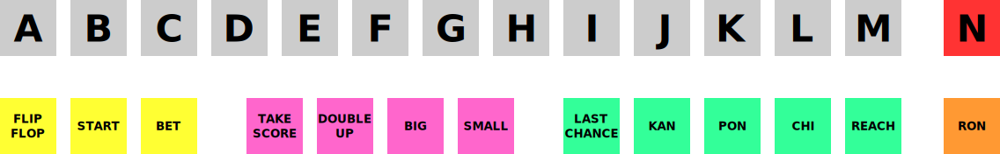

Default Keyboard Controls
=========================

.. contents:: :local:

.. _default-keys-foreword:

Controls Foreword
-----------------

MAME supports a vast array of different types of machines, with a
significantly different array of inputs across them. This means that some
keyboard keys, mouse buttons, and joystick buttons will be used for multiple
functions. As a result, the control charts below are separated by machine-types
to make it easier to find what you’re looking for.

All of the controls below are fully configurable in the user interface. These
charts show the default configuration.

Note that the defaults shown here are arranged by US ANSI key positioning. If
you are using a different layout, the keys will vary.

MAME User Interface Controls
----------------------------

The controls here cover MAME functions such as MAME’s menus, machine pause,
and saving/loading save states.

**Tab**
    Toggles the configuration menu.
**`**/**~** (backtick/tilde key)
    Toggles the On-Screen Display.

    If you are running with -debug, this key sends a ‘break’ in emulation.

    When a slider control is visible, you can use the following keys to control
    it:

    * **Up** - select previous parameter to modify.
    * **Down** - select next parameter to modify.
    * **Left** - decrease the value of the selected parameter.
    * **Right** - increase the value of the selected parameter.
    * **Enter** - reset parameter value to its default.
    * **Control+Left** - decrease the value by 10x.
    * **Shift+Left** - decrease the value by 0.1x.
    * **Alt+Left** - decrease the value by the smallest amount.
    * **Control+Right** - increase the value by 10x.
    * **Shift+Right** - increase the value by 0.1x.
    * **Alt+Right** - increase the value by the smallest amount.
    * **End** - temporarily hide the On Screen Display.
    * **Home** - bring the On Screen Display back after hiding it.
**Up Arrow**
    Highlight previous UI menu option.
**Down Arrow**
    Highlight next UI menu option.
**Left Arrow**
    Change current UI option setting when an arrow is present on it.
**Right Arrow**
    Change current UI option setting when an arrow is present on it.
**Home**/**End**
    Highlight first or last UI menu option.
**[** **]**
    Move to previous or next group in UI menus that support it (e.g. move to the
    inputs for the previous or next device in the **Input Assignments (this
    System)** menu).
**Enter**/**Joystick 1 Button 1**
    Select currently highlighted UI menu option.
**Space**
    Show comment on currently highlighted UI menu option.
**Delete**
    Clear/reset to default when highlighting an entry on the input
    configuration, cheat options, and plugin options pages.
**P**
    Pauses the emulated machine.
**Left Shift+P**
    While paused, advances to next frame. If rewind is enabled, a new rewind
    save state is also captured.
**Left Shift+~**
    While paused, loads the most recent rewind save state.
**F1**
    Power the machine on for machines that have specific power button behavior.
**F2**
    Power the machine off for machines that have specific power button behavior.
**F3**
    Soft resets the machine.
**Left Shift+F3**
    Performs a “hard reset”, which tears everything down and re-creates it from
    scratch. This is a more thorough and complete reset than the reset you get
    from hitting F3.
**F4**
    Shows the game palette, decoded graphics tiles/characters and any tilemaps.

    Use the Enter key to switch between the three modes (palette, graphics, and
    tilemaps).

    Press F4 again to turn off the display.
    The key controls in each mode vary slightly:

    Palette/colortable mode:

    * **[** **]** - switch between palette devices.
    * **Up**/**Down** - scroll up/down one line at a time.
    * **Page Up**/**Page Down** - scroll up/down one page at a time.
    * **Home**/**End** - move to top/bottom of list.
    * **-**/**+** - increase/decrease the number of colors per row.
    * **0** - restore the default number of colors per row.
    * **Enter** - switch to graphics viewer.

    Graphics mode:

    * **[** **]** - switch between different graphics sets.
    * **Up**/**Down** - scroll up/down one line at a time.
    * **Page Up**/**Page Down** - scroll up/down one page at a time.
    * **Home**/**End** - move to top/bottom of list.
    * **Left**/**Right** - change color displayed.
    * **R** - rotate tiles 90 degrees clockwise.
    * **-**/**+** - increase/decrease the number of tiles per row (hold Shift to
      restrict to integer scale factors).
    * **0** - restore the default number of tiles per row (hold Shift to
      restrict to integer scale factors).
    * **Enter** - switch to tilemap viewer.

    Tilemap mode:

    * **[** **]** - switch between different tilemaps.
    * **Up**/**Down**/**Left**/**Right** - scroll 8 pixels at a time.
    * **Shift+Up**/**Down**/**Left**/**Right** - scroll 1 pixel at a time.
    * **Control+Up**/**Down**/**Left**/**Right** - scroll 64 pixels at a time.
    * **R** - rotate tilemap view 90 degrees clockwise.
    * **-**/**+** - decrease/increase the zoom factor.
    * **0** - expand small tilemaps to fill the display.
    * **Enter** - switch to palette/colortable mode.

    Note: Not all systems have decoded graphics and/or tilemaps.
**Left Ctrl+F5**
    Toggle Filter.
    (*SDL MAME only*)
**Left Alt+Left Ctrl+F5**
    Toggle HLSL Post-Processing.
    (*Windows non-SDL MAME only*)
**F6**
    Toggle cheat mode. (if started with “-cheat”)
**Left Ctrl+F6**
    Decrease Prescaling.
**Left Ctrl+F7**
    Increase Prescaling.
**F7**
    Load a save state. You will be prompted to press a key or select from the
    menu to determine which save state you wish to load.

    *Note that the save state feature is not supported for a large number of
    drivers. If a given driver is not known to work perfectly, you will
    receive a warning that the save state may not be valid when attempting to
    save or load.*
**Left Shift+F7**
    Create a save state. Requires an additional keypress to identify the state,
    similar to the load option above. If an existing save state is present, it
    will also appear in the selection menu to allow overwriting of that save
    state.
**F8**
    Decrease frame skipping on the fly.
**F9**
    Increase frame skipping on the fly.
**F10**
    Toggle speed throttling.
**F11**
    Toggles speed display.
**Left Shift+F11**
    Toggles internal profiler display (if compiled in).
**Left Alt+F11**
    Record HLSL Rendered Video.
**F12**
    Saves a screen snapshot.
**Left Shift+F12**
    Begin recording MNG video.
**Left Control+Left Shift+F12**
    Begin recording AVI video.
**Left Alt+F12**
    Take HLSL Rendered Snapshot.
**Insert**
    Fast forward. While held, runs game with throttling disabled and with the
    maximum frameskip.
    (*Windows non-SDL MAME only*)
**Page Down**
    Fast forward. While held, runs game with throttling disabled and with the
    maximum frameskip.
    (*SDL MAME only*)
**Left Alt+Enter**
    Toggles between full-screen and windowed mode.
**Scroll Lock**/**Forward Delete** (Mac Desktop)/**fn-Delete** (Mac Laptop)
    Default mapping for the **uimodekey**.

    This key toggles MAME’s response to user interface keys such as the
    (by default) **Tab** key being used for menus. All emulated machines
    which require emulated keyboards will start with UI controls disabled by
    default and you can only access the internal UI by first hitting this
    **uimodekey** key. You can change the initial status of the emulated
    keyboard as presented upon start by using
    :ref:`-uimodekey<mame-commandline-uimodekey>`
**Escape**
    Exit emulator, return to the previous menu, or cancel the current UI option.

.. _default-selmenu-keys:

System and software selection menus
~~~~~~~~~~~~~~~~~~~~~~~~~~~~~~~~~~~

The system and software selection menus use additional controls

**Tab**
    Moves keyboard/controller focus to the next UI panel.
**Shift+Tab**
    Moves keyboard/controller focus to the previous UI panel.
**Left Alt+F**
    Adds or removes the selected system or software list item from the favorites
    list.
**Left Alt+E**
    Exports the currently displayed list of systems.
**Left Alt+D**
    Shows the full-size info viewer if info is available for the selected system
    or software list item.  (Shows information loaded by the data plugin from
    external files, including history.xml and mameinfo.dat.)
**F1**
    Audits system ROMs and disk images.

.. _default-arcade-keys:

Default Arcade Machine Controls
-------------------------------

This section covers controls that are applicable to most kinds of arcade
machines.  Note that not all machines will have all of these controls.  All the
controls below are fully configurable in the user interface.  This list shows
the standard keyboard configuration.

**5** *(not numeric keypad)*
    Coin slot 1
**6** *(not numeric keypad)*
    Coin slot 2
**7** *(not numeric keypad)*
    Coin slot 3
**8** *(not numeric keypad)*
    Coin slot 4
**Backspace**
    Bill 1 (For machines that have a bill receptor/note reader)
**T**
    Tilt

    Usually a tilt switch or shock sensor that will end the current game, reset
    credits and/or reset the machine if the machine is knocked excessively hard
    or moved.  Most commonly found on pinball machines.
**-** *(not numeric keypad)*
    Volume Down

    For machines that have an electronic volume control.
**=** *(not numeric keypad)*
    Volume Up

    For machines that have an electronic volume control.
**F1**
    Memory Reset

    This resets high scores, credits/winnings, statistics, and/or operator
    settings on machines that support it.
**F2**
    Service Mode

    This is a momentary push-button on some machines, while it is a toggle
    switch or DIP switch on others.
**9** *(not numeric keypad)*
    Service 1

    Service buttons are typically used to give free credits or to navigate the
    operator service menus.
**0** *(not numeric keypad)*
    Service 2
**-** *(not numeric keypad)*
    Service 3
**=** *(not numeric keypad)*
    Service 4

.. _default-game-keys:

Default Arcade Game Controls
----------------------------

This section covers controls for arcade games using common joystick/button
control schemes.  All the controls below are fully configurable in the user
interface.  This list shows the standard keyboard configuration.

**5** *(not numeric keypad)*
    Coin slot 1
**6** *(not numeric keypad)*
    Coin slot 2
**7** *(not numeric keypad)*
    Coin slot 3
**8** *(not numeric keypad)*
    Coin slot 4
**1** *(not numeric keypad)*
    Player 1 start or 1 player mode
**2** *(not numeric keypad)*
    Player 2 start or 2 players mode
**3** *(not numeric keypad)*
    Player 3 start or 3 players mode
**4** *(not numeric keypad)*
    Player 4 start or 4 players mode

.. _default-player1-keys:

Player 1 Controls
~~~~~~~~~~~~~~~~~

**Up Arrow**
    Player 1 Up
**Down Arrow**
    Player 1 Down
**Left Arrow**
    Player 1 Left
**Right Arrow**
    Player 1 Right
**E**
    Player 1 Up on Left Stick for dual-stick machines (e.g. Robotron)
**D**
    Player 1 Down on Left Stick for dual-stick machines (e.g. Robotron)
**S**
    Player 1 Left on Left Stick for dual-stick machines (e.g. Robotron)
**F**
    Player 1 Right on Left Stick for dual-stick machines (e.g. Robotron)
**I**
    Player 1 Up on Right Stick for dual-stick machines (e.g. Robotron)
**K**
    Player 1 Down on Right Stick for dual-stick machines (e.g. Robotron)
**J**
    Player 1 Left on Right Stick for dual-stick machines (e.g. Robotron)
**L**
    Player 1 Right on Right Stick for dual-stick machines (e.g. Robotron)
**Left Ctrl**/**Mouse B0**/**Gun 1 Button 0**
    Player 1 Button 1
**Left Alt**/**Mouse B2**/**Gun 1 Button 1**
    Player 1 Button 2
**Spacebar**/**Mouse B1**/**Joystick 1 Button 1 or B**
    Player 1 Button 3
**Left Shift**
    Player 1 Button 4
**Z**
    Player 1 Button 5
**X**
    Player 1 Button 6
**C**
    Player 1 Button 7
**V**
    Player 1 Button 8
**B**
    Player 1 Button 9
**N**
    Player 1 Button 10
**M**
    Player 1 Button 11
**,**
    Player 1 Button 12
**.**
    Player 1 Button 13
**/**
    Player 1 Button 14
**Right Shift**
    Player 1 Button 15

.. _default-player2-keys:

Player 2 Controls
~~~~~~~~~~~~~~~~~

**R**
    Player 2 Up
**F**
    Player 2 Down
**D**
    Player 2 Left
**G**
    Player 2 Right
**A**
    Player 2 Button 1
**S**
    Player 2 Button 2
**Q**
    Player 2 Button 3
**W**
    Player 2 Button 4
**E**
    Player 2 Button 5

.. _default-player3-keys:

Player 3 Controls
~~~~~~~~~~~~~~~~~

**I**
    Player 3 Up
**K**
    Player 3 Down
**J**
    Player 3 Left
**L**
    Player 3 Right
**Right Control**
    Player 3 Button 1
**Right Shift**
    Player 3 Button 2
**Enter** *(not numeric keypad)*
    Player 3 Button 3

.. _default-player4-keys:

Player 4 Controls
~~~~~~~~~~~~~~~~~

**8** *(on numeric keypad)*
    Player 4 Up
**2** *(on numeric keypad)*
    Player 4 Down
**4** *(on numeric keypad)*
    Player 4 Left
**6** *(on numeric keypad)*
    Player 4 Right
**0** *(on numeric keypad)*
    Player 4 Button 1
**.** *(on numeric keypad)*
    Player 4 Button 2
**Enter** *(on numeric keypad)*
    Player 4 Button 3

.. _default-mahjong-hanafuda-keys:

Default Mahjong and Hanafuda Keys
---------------------------------

Most mahjong and hanafuda games use a standard control panel layout.  Some keys
may not be present, depending on the kind of game.  For example games without a
bonus game feature may lack the Take Score, Double Up, Big and Small keys, and
games without gambling features may also lack the Bet key.  Some games may not
use all keys that are present. For example many games do not use the Flip Flop
and Last Chance keys.

Due to the large number of keys, MAME only provides default input configuration
for a single set of player controls.  For multi-player mahjong/hanafuda games,
or mahjong/hanafuda games with multiple player positions, manual configuration
is required. All the keys below are fully configurable in the user interface.
This list shows the standard keyboard configuration.

**5** *(not numeric keypad)*
    Coin slot 1
**6** *(not numeric keypad)*
    Coin slot 2
**7** *(not numeric keypad)*
    Coin slot 3
**8** *(not numeric keypad)*
    Coin slot 4
**Y**
    Player 1 Mahjong/Hanafuda Flip Flop
**1** *(not numeric keypad)*
    Player 1 start or 1 player mode
**2** *(not numeric keypad)*
    Player 2 start or 2 players mode
**3** *(not numeric keypad)*
    Player 3 start or 3 players mode

    Mahjong Bet
**4** *(not numeric keypad)*
    Player 4 start or 4 players mode
**Right Ctrl**
    Player 1 Mahjong/Hanafuda Take Score
**Right Shift**
    Player 1 Mahjong/Hanafuda Double Up
**Enter**
    Player 1 Mahjong/Hanafuda Big
**Backspace**
    Player 1 Mahjong/Hanafuda Small
**Right Alt**
    Player 1 Mahjong/Hanafuda Last Chance
**Ctrl**
    Mahjong Kan
**Alt**
    Mahjong Pon
**Spacebar**
    Mahjong Chi
**Shift**
    Mahjong Reach
**Z**
    Mahjong Ron
**A**
    Player 1 Mahjong/Hanafuda A
**B**
    Player 1 Mahjong/Hanafuda B
**C**
    Player 1 Mahjong/Hanafuda C
**D**
    Player 1 Mahjong/Hanafuda D
**E**
    Player 1 Mahjong/Hanafuda E
**F**
    Player 1 Mahjong/Hanafuda F
**G**
    Player 1 Mahjong/Hanafuda G
**H**
    Player 1 Mahjong/Hanafuda H
**I**
    Player 1 Mahjong I
**J**
    Player 1 Mahjong J
**K**
    Player 1 Mahjong K
**L**
    Player 1 Mahjong L
**M**
    Player 1 Mahjong M

    Player 1 Hanafuda Yes
**N**
    Player 1 Mahjong N

    Player 1 Hanafuda No
**O**
    Player 1 Taiwanese Mahjong O
**Semicolon**
    Player 1 Taiwanese Mahjong P
**Q**
    Player 1 Taiwanese Mahjong Q

.. _default-gambling-keys:

Default Gambling Keys
---------------------

All the keys below are fully configurable in the user interface. This list shows
the standard keyboard configuration.

Note that many gambling games use buttons for multiple functions.  For example a
slots game may use the Start button to stop all reels, lacking a dedicated Stop
All Reels button, or a poker game may use the hold buttons to control the
double-up bonus game, lacking dedicated Take Score, Double Up, High and Low
buttons.

**5**
    Coin slot 1
**6**
    Coin slot 2
**7**
    Coin slot 3
**8**
    Coin slot 4
**Backspace**
    Bill 1 (For machines that have a bill receptor/note reader)
**I**
    Payout
**Q**
    Key In
**W**
    Key Out
**F1**
    Memory Reset
**9** *(not numeric keypad)*
    Service 1 (Service buttons are typically used to give free credits or to
    navigate the internal operator service menus)
**0** *(not numeric keypad)*
    Service 2
    Book-Keeping (for machines that have this functionality)
**-** *(not numeric keypad)*
    Service 3
**=** *(not numeric keypad)*
    Service 4
**M**
    Bet
**1** *(not numeric keypad)*
    Player 1 start or 1 player mode
**2** *(not numeric keypad)*
    Deal
**L**
    Stand
**4** *(not numeric keypad)*
    Take Score

    For games that allow gambling winnings in a double-or-nothing bonus game,
    this takes the winnings from the main game.
**3** *(not numeric keypad)*
    Double Up

    For games that allow gambling winnings in a double-or-nothing bonus game,
    this gambles the winnings from the main game in the bonus game.
**D**
    Half Gamble

    Used by games that allow gambling half or all of the winnings from the main
    game in the bonus game.
**A**
    High
**S**
    Low
**O**
    Door

.. _default-blackjack-keys:

Default Blackjack Keys
~~~~~~~~~~~~~~~~~~~~~~

All the keys below are fully configurable in the user interface. This list shows
the standard keyboard configuration.

**1**
    Player 1 start or 1 player mode

    Used to deal a new hand for games that have separate buttons to deal a new
    hand and draw an additional card.
**2**
    Deal (hit)

    Used to draw an additional card, and to deal a new hand in games that don’t
    use separate buttons to deal a new hand and draw an additional card.
**L**
    Stand

.. _default-poker-keys:

Default Poker Keys
~~~~~~~~~~~~~~~~~~

All the keys below are fully configurable in the user interface. This list shows
the standard keyboard configuration.

**1**
    Player 1 start or 1 player mode

    Used to deal a new hand for games that have separate buttons to deal a new
    hand and draw replacement cards.
**2**
    Deal

    Used to draw replacement cards, and to deal a new hand in games that don’t
    use separate buttons to deal a new hand and draw replacement cards.
**Z**
    Hold 1/discard 1
**X**
    Hold 2/discard 2
**C**
    Hold 3/discard 3
**V**
    Hold 4/discard 4
**B**
    Hold 5/discard 5
**N**
    Cancel

    Used by some games to cancel current selection for cards to hold/discard.

.. _default-slots-keys:

Default Slots Keys
~~~~~~~~~~~~~~~~~~

All the keys below are fully configurable in the user interface. This list shows
the standard keyboard configuration.

**1**
    Player 1 start or 1 player mode
**X**
    Stop Reel 1
**C**
    Stop Reel 2
**V**
    Stop Reel 3
**B**
    Stop Reel 4
**Z**
    Stop All Reels

.. _default-computer-keys:

Default Computer Keys
---------------------

All the keys below are fully configurable in the user interface. This list shows
the standard keyboard configuration.

Note that controls can vary widely by computer type, so not all keys are shown
here. See the **Input Assignments (this system)** section of MAME’s Input
Settings menu for details for the machine you are currently using.

**Tab**
    Toggles the configuration menu.
**Scroll Lock**/**Forward Delete** (Mac Desktop)/**fn-Delete** (Mac Laptop)
    Default mapping for the **uimodekey**.

    This key toggles MAME’s response to user interface keys such as the
    (by default) **Tab** key being used for menus. All emulated machines
    which require emulated keyboards will start with UI controls disabled by
    default and you can only access the internal UI by first hitting this
    **uimodekey** key. You can change the initial status of the emulated
    keyboard as presented upon start by using
    :ref:`-uimodekey<mame-commandline-uimodekey>`
**F2**
    Start tape for machines that have cassette tape drives.
**Shift+F2**
    Stop tape for machines that have cassette tape drives.
**Left Shift+Scroll Lock**
    Pastes from system clipboard into the emulated machine.
**Alphanumeric Keys**
    These keys are mapped to their equivalents in the emulated machine by
    default.

.. _default-othermachine-keys:

Other Machines
--------------

All the keys are fully configurable in the user interface.

Note that controls can vary widely by machine type, so default keys are not
shown here and defaults will vary considerably based on the manufacturer and
style. See the **Input Assignments (this system)** section of MAME’s Input
Settings menu for details for the machine you are currently using.
