# SAM8905 Algorithm Appendix 1

**Source**: DREAM S.A. samSOUND V1.0, May 1989 - Appendix 1
**Transcription date**: 2026-01-28
**Purpose**: Reference catalog of SAM8905 algorithms. Use to identify algorithms found in firmware ROM dumps and to document their signal flow.

## TODO

- [x] Transcribe chart legend
- [x] Algorithm 1681 - Electronic organ flutes (16'+8'+1')
- [x] Algorithm 16842 - Electronic organ flutes (16'+8'+4'+2')
- [x] Algorithm 16852 - Electronic organ flutes (16'+8'+5'1/3)
- [x] Algorithm AM - Ring modulation (2 independent)
- [x] Algorithm AM2 - Ring mod by PM sinus
- [x] Algorithm AM3 - Ring mod by FM sinus
- [x] Algorithm FB2 - Feed-back (2 oscillators)
- [x] Algorithm FBSVLPBP - Filtered feed-back (LP+BP)
- [x] Algorithm FM4Y0 - Cascaded FM (topology 0)
- [x] Algorithm FM4Y1 - Cascaded FM (topology 1)
- [x] Algorithm FM4Y2 - Cascaded FM (topology 2)
- [x] Algorithm FM4Y4 - Cascaded FM (topology 4)
- [x] Algorithm FM4Y6 - Cascaded FM (topology 6)
- [x] Algorithm FM4Y8 - Cascaded FM (topology 8)
- [x] Algorithm FM4Y9 - Cascaded FM (topology 9)
- [x] Algorithm FMPY0 - Cascaded FM/PM hybrid
- [x] Algorithm FMSVLP - FM oscillator low-pass filtered
- [x] Algorithm FPBY2 - Cascaded PM with feed-back
- [ ] Remaining algorithms (add as scans become available)
- [ ] Cross-reference algorithms to firmware ROM A-RAM data
- [ ] Map algorithm names to MS4 program numbers

---

## Chart Legend

### Node Shapes

| Shape | Examples | Description |
|-------|----------|-------------|
| Rectangle | `DPHI0`, `x6`, `WF0` | **Oscillator**: sinus oscillator, sinus with frequency multiplier, wave oscillator. WF without number = wave from special object |
| Hexagon | `RING`, `PM`, `LP12` | **Signal processing**: ring modulation, phase modulation, 12 dB low-pass filter, etc. |
| Trapezoid | `DA1`, `MIXL MIXR`, `MIX_16` | **Amplitude processing**: amplitude envelope, mix from special object, mix from transfer object |

### Conventions

- **Underlined** parameters can be assigned to modulators (LFO, EG, etc.)
- Frequency labels above oscillators indicate the DPHI source (e.g. `DPHI`, `DPHIC`)
- Multiplier labels (x1, x2, x4, etc.) indicate frequency multiplication relative to base DPHI
- MIX_N transfer objects set per-footage mix levels
- DA/DAPC are amplitude slope objects (software envelope control)

---

## Algorithm: 1681

**Name**: 1681
**Family**: Electronic organ flutes
**Description**: Used typically to generate 16'+8'+1' footages with chorus or tremolo. Footage mix/pan controlled by MIX_1 to MIX_1, general volume by DA.

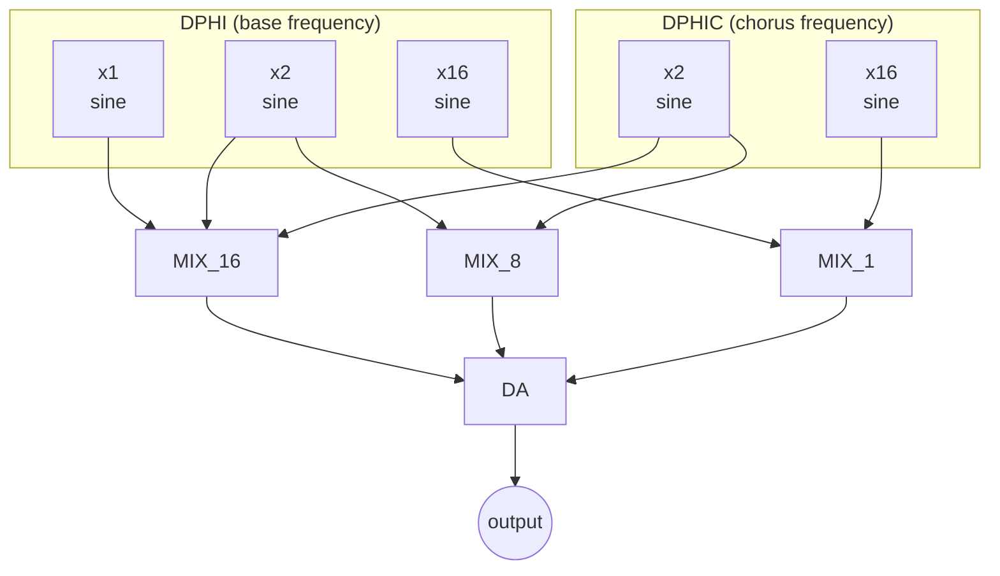

### Signal Flow

| Footage | Oscillators | Mix Control |
|---------|------------|-------------|
| 16' | DPHI x1, DPHIC x2 | MIX_16 |
| 8' | DPHI x2, DPHIC x2 | MIX_8 |
| 1' | DPHI x16, DPHIC x16 | MIX_1 |

---

## Algorithm: 16842

**Name**: 16842
**Family**: Electronic organ flutes
**Description**: Used typically to generate 16'+8'+4'+2' footages with chorus or tremolo.

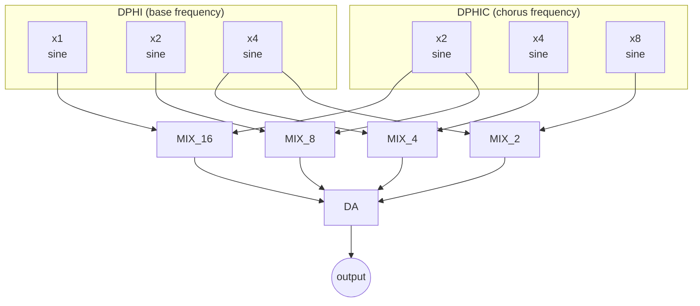

### Signal Flow

| Footage | Oscillators | Mix Control |
|---------|------------|-------------|
| 16' | DPHI x1, DPHIC x2 | MIX_16 |
| 8' | DPHI x2, DPHIC x2 | MIX_8 |
| 4' | DPHI x4, DPHIC x4 | MIX_4 |
| 2' | DPHI x4, DPHIC x8 | MIX_2 |

---

## Algorithm: 16852

**Name**: 16852
**Family**: Electronic organ flutes
**Description**: Used typically to generate 16'+8'+5'1/3 footages with chorus or tremolo. Independent 6th harmonic (typ 2'2/3 percussion).

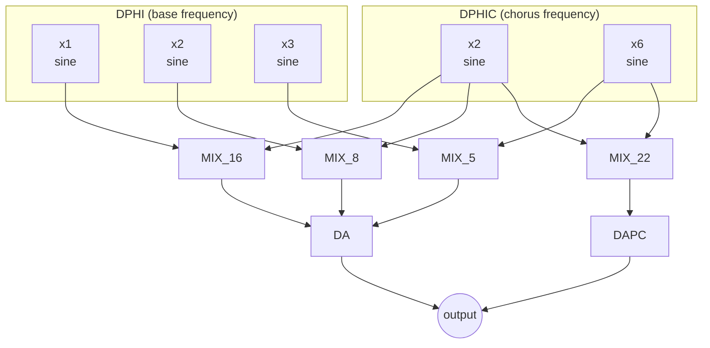

### Signal Flow

| Footage | Oscillators | Mix Control | Amplitude |
|---------|------------|-------------|-----------|
| 16' | DPHI x1, DPHIC x2 | MIX_16 | DA |
| 8' | DPHI x2, DPHIC x2 | MIX_8 | DA |
| 5'1/3 | DPHI x3, DPHIC x6 | MIX_5 | DA |
| 2'2/3 (perc) | DPHIC x6, DPHIC x2 | MIX_22 | DAPC (independent) |

---

## Algorithm: AM

**Name**: AM
**Family**: Ring modulation
**Description**: 2 independent ring modulators in parallel. To be used with internal waves only.

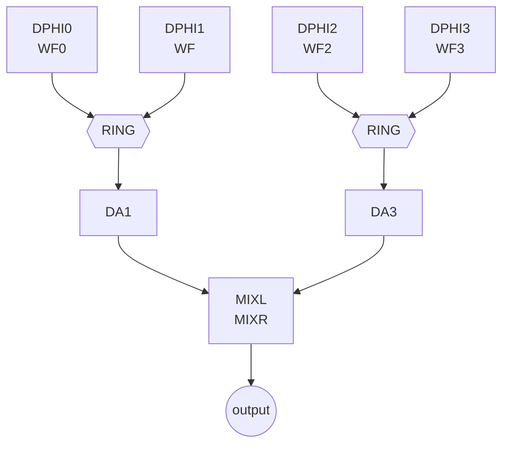

### Signal Flow

| Path | Oscillators | Processing | Amplitude |
|------|------------|------------|-----------|
| 1 | DPHI0 (WF0) × DPHI1 (WF) | RING mod | DA1 |
| 2 | DPHI2 (WF2) × DPHI3 (WF3) | RING mod | DA3 |

Both paths sum to MIXL/MIXR output.

---

## Algorithm: AM2

**Name**: AM2
**Family**: Ring modulation
**Description**: Ring modulation by phase modulated sinus oscillator.

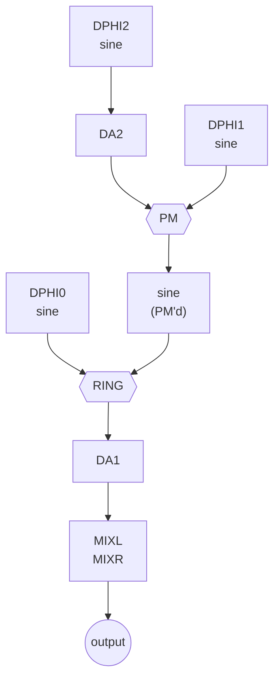

### Signal Flow

1. **PM modulator path**: DPHI2 sine -> DA2 (amplitude) -> phase modulates DPHI1 sine
2. **Ring mod**: DPHI0 sine × PM'd DPHI1 sine -> RING
3. **Output**: RING -> DA1 (amplitude) -> MIXL/MIXR

---

## Algorithm: AM3

**Name**: AM3
**Family**: Ring modulation
**Description**: Ring modulation by freq modulated sinus oscillator.

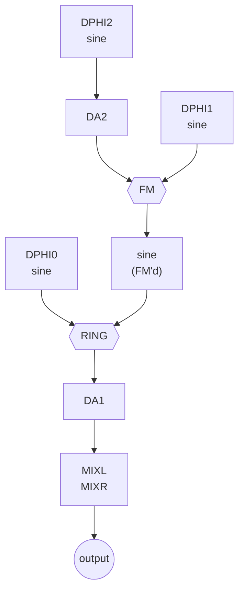

### Signal Flow

1. **FM modulator path**: DPHI2 sine -> DA2 (amplitude) -> freq modulates DPHI1 sine
2. **Ring mod**: DPHI0 sine × FM'd DPHI1 sine -> RING
3. **Output**: RING -> DA1 (amplitude) -> MIXL/MIXR

---

## Algorithm: FB2

**Name**: FB2
**Family**: Feed-back
**Description**: 2 feed-back oscillators, feed-back taken after DA (Harmonic content increases with DA).

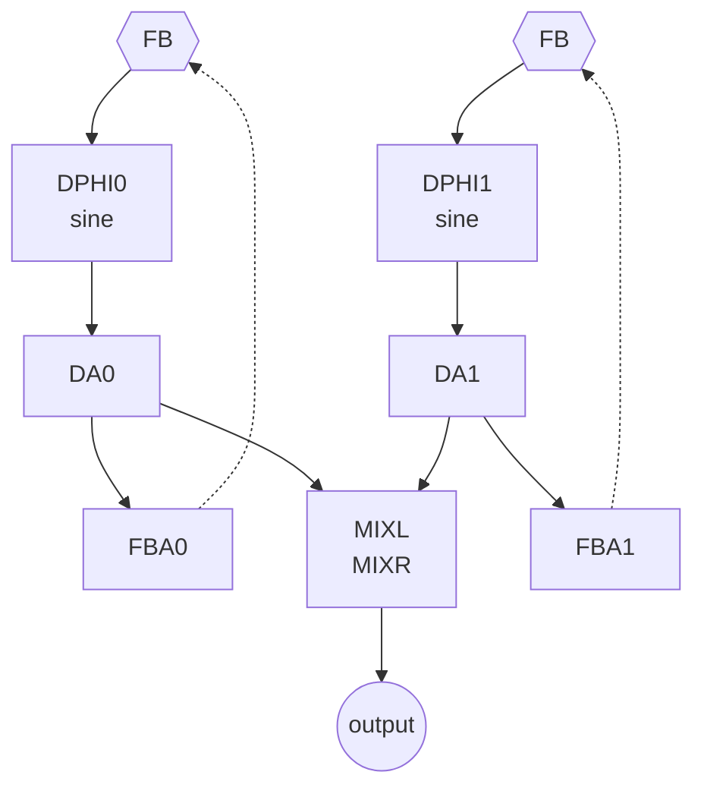

### Signal Flow

| Path | Oscillator | Amplitude | Feed-back | Notes |
|------|-----------|-----------|-----------|-------|
| 0 | DPHI0 sine | DA0 | FBA0 (post-DA) | Harmonic content increases with DA |
| 1 | DPHI1 sine | DA1 | FBA1 (post-DA) | Independent from path 0 |

---

## Algorithm: FBSVLPBP

**Name**: FBSVLPBP
**Family**: Feed-back
**Description**: Filtered feed-back oscillator, with low-pass and band-pass outputs. Warnings: ALP and ABP are not smoothed, noise may happen if a modulator is applied. Care must be taken to run with small DA values when using high resonance to avoid filter overflow.

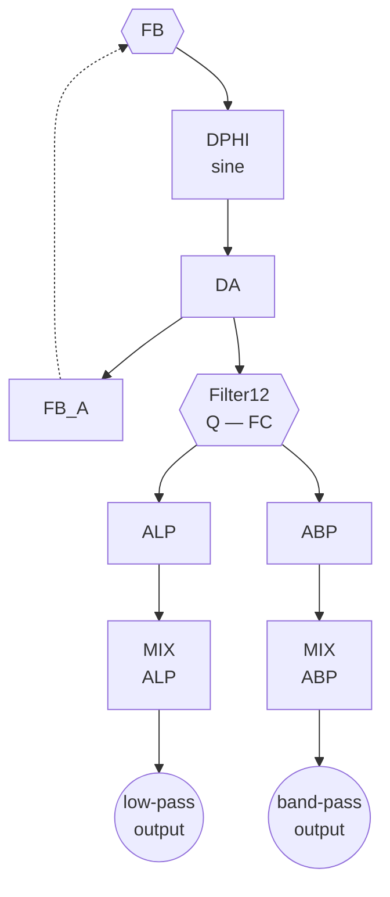

### Signal Flow

1. **Oscillator**: DPHI sine with feed-back (FB_A controls amount)
2. **Filter**: 12 dB state-variable filter with Q (resonance) and FC (cutoff) controls
3. **Outputs**: Low-pass (ALP + MIX_ALP) and band-pass (ABP + MIX_ABP) in parallel

### Parameters

| Parameter | Description |
|-----------|-------------|
| DA | Feed-back oscillator amplitude (keep small with high Q) |
| FB_A | Feed-back amount |
| Q | Filter resonance |
| FC | Filter cutoff frequency |
| ALP | Low-pass output amplitude |
| ABP | Band-pass output amplitude |

---

## Algorithm: FM4Y0

**Name**: FM4Y0
**Family**: FM
**Description**: Cascaded FM. Warning: A3 is not smoothed, noise may happen if a modulator is applied.

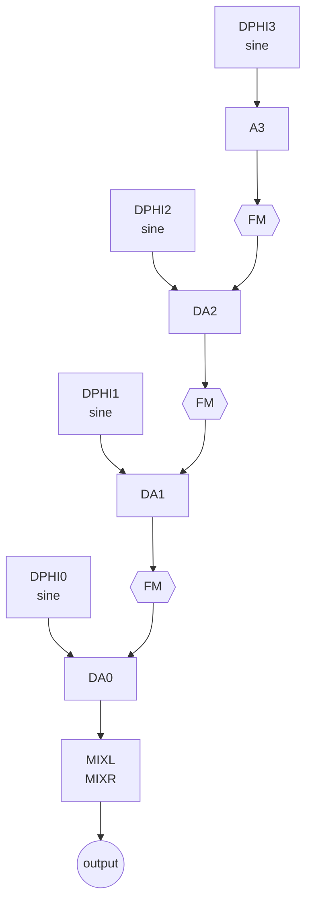

### Topology

```
DPHI3 -> A3 -> FM -> DPHI2 -> DA2 -> FM -> DPHI1 -> DA1 -> FM -> DPHI0 -> DA0 -> MIXL/MIXR
```

4 operators in series. Single carrier (DPHI0), 3 modulators cascaded.

---

## Algorithm: FM4Y1

**Name**: FM4Y1
**Family**: FM
**Description**: Cascaded FM. Warning: A3 is not smoothed, noise may happen if a modulator is applied.


### Topology

```
DPHI3 -> A3 -> FM -> DPHI2 -> DA2 -> FM -> DPHI1 -> DA1 -> FM -> DPHI0 -> DA0 -> MIXL/MIXR
```

Same chain as FM4Y0, different frequency linking (DPHI3 independent, DPHI2 linked to DPHI3, DPHI1 linked to DPHI2, DPHI0 independent).

---

## Algorithm: FM4Y2

**Name**: FM4Y2
**Family**: FM
**Description**: Cascaded FM. Warning: A3 is not smoothed, noise may happen if a modulator is applied.


### Topology

```
DPHI3 -> A3 -> FM -> DPHI2 -> DA2 -> FM -> DPHI1 -> DA1 -> FM -> DPHI0 -> DA0 -> MIXL/MIXR
```

Same chain as FM4Y0, different frequency linking (DPHI3 independent, DPHI2 linked to DPHI1, DPHI1 linked to DPHI0, DPHI0 independent).

---

## Algorithm: FM4Y4

**Name**: FM4Y4
**Family**: FM
**Description**: Cascaded FM. Warning: A3 is not smoothed, noise may happen if a modulator is applied.

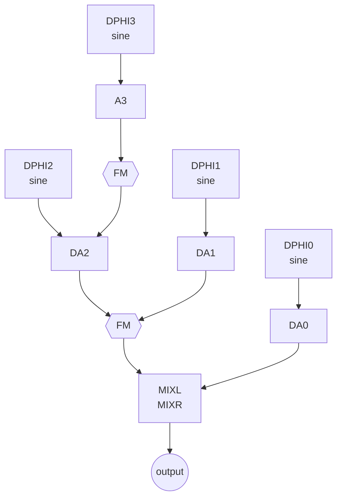

### Topology

```
DPHI3 -> A3 -> FM -> DPHI2 -> DA2 -\
                                     +-> FM -> MIXL/MIXR
             DPHI1 -> DA1 ----------/
             DPHI0 -> DA0 ----------------> MIXL/MIXR
```

Split topology: DPHI3 modulates DPHI2, then DPHI2+DPHI1 FM merge. DPHI0 is independent carrier to output.

---

## Algorithm: FM4Y6

**Name**: FM4Y6
**Family**: FM
**Description**: Cascaded FM. Warning: A3 is not smoothed, noise may happen if a modulator is applied.

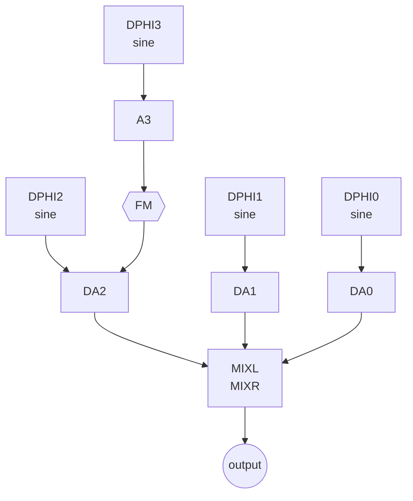

### Topology

```
DPHI3 -> A3 -> FM -> DPHI2 -> DA2 -> MIXL/MIXR
                     DPHI1 -> DA1 -> MIXL/MIXR
                     DPHI0 -> DA0 -> MIXL/MIXR
```

Only DPHI3 modulates DPHI2. Three carriers (DPHI2, DPHI1, DPHI0) sum to output.

---

## Algorithm: FM4Y8

**Name**: FM4Y8
**Family**: FM
**Description**: Cascaded FM. Warning: A3 is not smoothed, noise may happen if a modulator is applied.

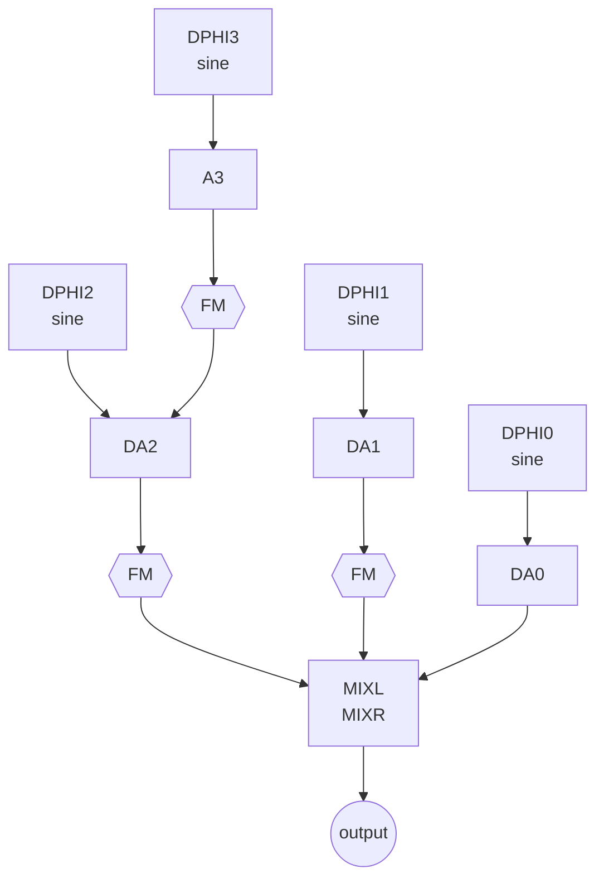

### Topology

```
DPHI3 -> A3 -> FM -> DPHI2 -> DA2 -> FM -\
                     DPHI1 -> DA1 -> FM ---+-> MIXL/MIXR
                     DPHI0 -> DA0 --------/
```

DPHI3 modulates DPHI2 (chain of 2). DPHI1 FM'd independently. All three paths sum to output.

---

## Algorithm: FM4Y9

**Name**: FM4Y9
**Family**: FM
**Description**: Cascaded FM. Warning: A3 is not smoothed, noise may happen if a modulator is applied.

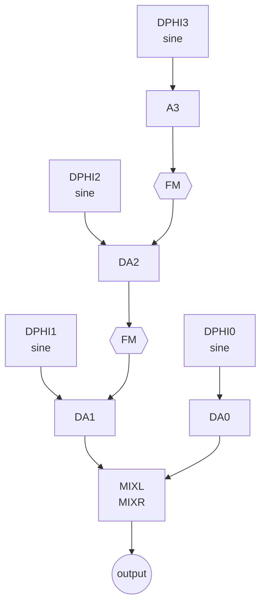

### Topology

```
DPHI3 -> A3 -> FM -> DPHI2 -> DA2 -> FM -> DPHI1 -> DA1 -> MIXL/MIXR
                                     DPHI0 -> DA0 -------> MIXL/MIXR
```

3-operator chain (DPHI3->DPHI2->DPHI1) plus independent carrier DPHI0. Two outputs summed.

---

## Algorithm: FMPY0

**Name**: FMPY0
**Family**: FM/PM
**Description**: Cascaded FM with PM between 2 and 1. Warning: A3 is not smoothed, noise may happen if a modulator is applied.


### Topology

```
DPHI3 -> A3 -> FM -> DPHI2 -> DA2 -> PM -> DPHI1 -> DA1 -> FM -> DPHI0 -> DA0 -> MIXL/MIXR
```

Like FM4Y0 but with PM (phase modulation) between operators 2 and 1 instead of FM.

---

## Algorithm: FMSVLP

**Name**: FMSVLP
**Family**: FM
**Description**: FM oscillator low-pass filtered. Care must be taken to run with small A0 values when using high resonance to avoid filter overflow.

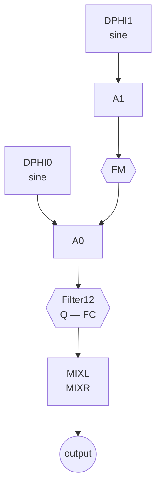

### Signal Flow

1. **Modulator**: DPHI1 sine -> A1 (amplitude) -> FM modulates DPHI0
2. **Carrier**: DPHI0 sine -> A0 (amplitude)
3. **Filter**: 12 dB state-variable low-pass with Q and FC
4. **Output**: Filtered signal -> MIXL/MIXR

---

## Algorithm: FPBY2

**Name**: FPBY2
**Family**: PM
**Description**: Cascaded PM with feed-back. PM+ means "boosted" PM. Warning: A3 is not smoothed, noise may happen if a modulator is applied.

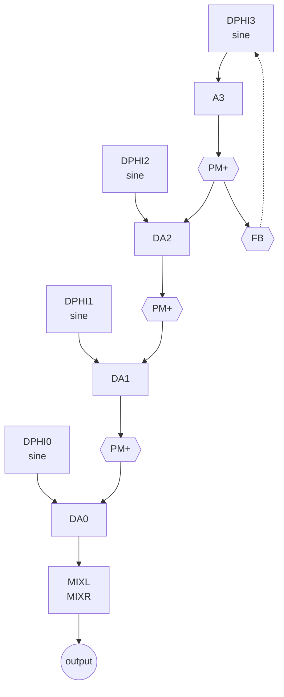

### Topology

```
FB -> DPHI3 -> A3 -> PM+ -> DPHI2 -> DA2 -> PM+ -> DPHI1 -> DA1 -> PM+ -> DPHI0 -> DA0 -> MIXL/MIXR
 ^                    |                                                      (MIXL/MIXR defined in A3)
 +--------------------+
```

4-operator cascaded PM (boosted) with feed-back on operator 3. Single output via DA0. Note: MIXL/MIXR is defined in A3 (the feed-back oscillator's amplitude object).

---

## Index

| Algorithm | Family | Oscillators | Key Feature |
|-----------|--------|-------------|-------------|
| 1681 | Organ flutes | 5 (3+2 chorus) | 16'+8'+1' footages |
| 16842 | Organ flutes | 6 (3+3 chorus) | 16'+8'+4'+2' footages |
| 16852 | Organ flutes | 5 (3+2 chorus) | 16'+8'+5'1/3 + independent 2'2/3 perc |
| AM | Ring mod | 4 (wave osc) | 2 independent ring modulators |
| AM2 | Ring mod | 3 (sine) | Ring mod by PM sinus |
| AM3 | Ring mod | 3 (sine) | Ring mod by FM sinus |
| FB2 | Feed-back | 2 (sine+FB) | 2 independent FB oscillators, post-DA feedback |
| FBSVLPBP | Feed-back | 1 (sine+FB) | FB oscillator + 12dB SVF (LP+BP outputs) |
| FM4Y0 | FM | 4 (sine) | Cascaded FM: 3->2->1->0 (all series) |
| FM4Y1 | FM | 4 (sine) | Cascaded FM: 3->2->1->0 (linked freq variant) |
| FM4Y2 | FM | 4 (sine) | Cascaded FM: 3->2->1->0 (linked freq variant) |
| FM4Y4 | FM | 4 (sine) | Cascaded FM: 3->2 split, 0 independent carrier |
| FM4Y6 | FM | 4 (sine) | FM: only 3->2, three independent carriers |
| FM4Y8 | FM | 4 (sine) | FM: 3->2 chain + 1 FM, three paths to output |
| FM4Y9 | FM | 4 (sine) | FM: 3->2->1 chain + 0 independent carrier |
| FMPY0 | FM/PM | 4 (sine) | Like FM4Y0 but PM between operators 2 and 1 |
| FMSVLP | FM | 2 (sine) | FM oscillator + 12dB SVF low-pass |
| FPBY2 | PM | 4 (sine) | Cascaded PM+ with feed-back on operator 3 |
