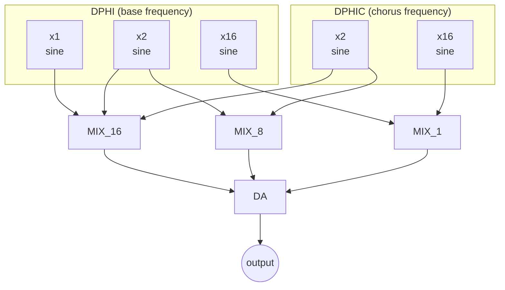
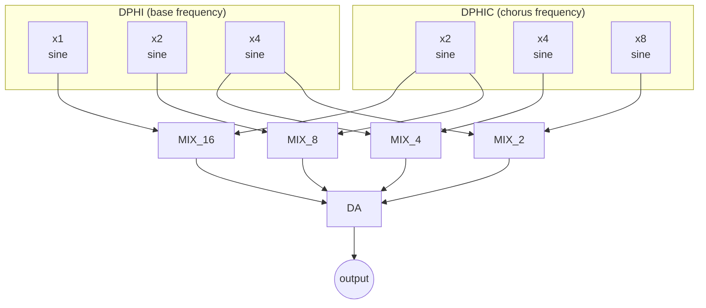
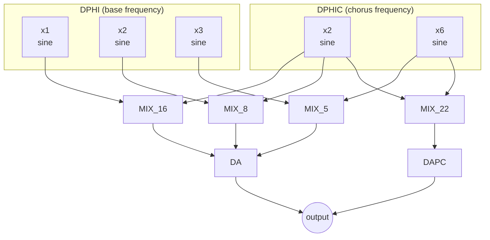
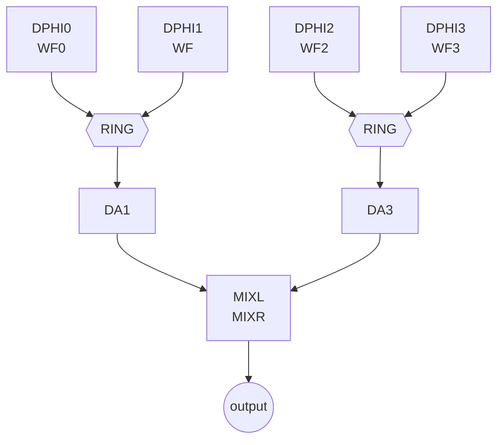
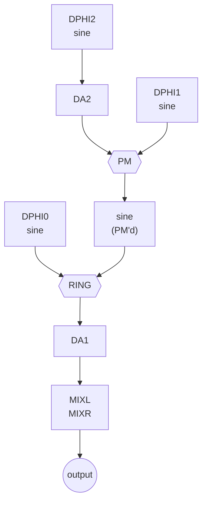
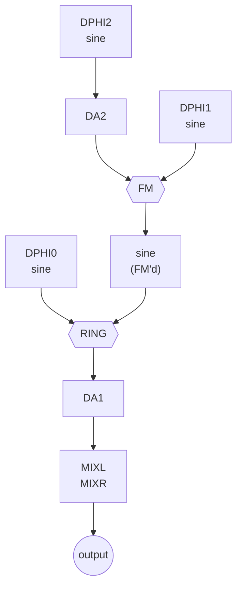

# SAM8905 Algorithm Appendix 1

**Source**: DREAM S.A. samSOUND V1.0, May 1989 - Appendix 1
**Transcription date**: 2026-01-28
**Purpose**: Reference catalog of SAM8905 algorithms. Use to identify algorithms found in firmware ROM dumps and to document their signal flow.

## TODO

- [x] Transcribe chart legend
- [x] Algorithm 1681 - Electronic organ flutes (16'+8'+1')
- [x] Algorithm 16842 - Electronic organ flutes (16'+8'+4'+2')
- [x] Algorithm 16852 - Electronic organ flutes (16'+8'+5'1/3)
- [x] Algorithm AM - Ring modulation (2 independent)
- [x] Algorithm AM2 - Ring mod by PM sinus
- [x] Algorithm AM3 - Ring mod by FM sinus
- [ ] Remaining algorithms (add as scans become available)
- [ ] Cross-reference algorithms to firmware ROM A-RAM data
- [ ] Map algorithm names to MS4 program numbers

---

## Chart Legend

### Node Shapes

| Shape | Examples | Description |
|-------|----------|-------------|
| Rectangle | `DPHI0`, `x6`, `WF0` | **Oscillator**: sinus oscillator, sinus with frequency multiplier, wave oscillator. WF without number = wave from special object |
| Hexagon | `RING`, `PM`, `LP12` | **Signal processing**: ring modulation, phase modulation, 12 dB low-pass filter, etc. |
| Trapezoid | `DA1`, `MIXL MIXR`, `MIX_16` | **Amplitude processing**: amplitude envelope, mix from special object, mix from transfer object |

### Conventions

- **Underlined** parameters can be assigned to modulators (LFO, EG, etc.)
- Frequency labels above oscillators indicate the DPHI source (e.g. `DPHI`, `DPHIC`)
- Multiplier labels (x1, x2, x4, etc.) indicate frequency multiplication relative to base DPHI
- MIX_N transfer objects set per-footage mix levels
- DA/DAPC are amplitude slope objects (software envelope control)

---

## Algorithm: 1681

**Name**: 1681
**Family**: Electronic organ flutes
**Description**: Used typically to generate 16'+8'+1' footages with chorus or tremolo. Footage mix/pan controlled by MIX_1 to MIX_1, general volume by DA.

### Signal Flow

| Footage | Oscillators | Mix Control |
|---------|------------|-------------|
| 16' | DPHI x1, DPHIC x2 | MIX_16 |
| 8' | DPHI x2, DPHIC x2 | MIX_8 |
| 1' | DPHI x16, DPHIC x16 | MIX_1 |

---

## Algorithm: 16842

**Name**: 16842
**Family**: Electronic organ flutes
**Description**: Used typically to generate 16'+8'+4'+2' footages with chorus or tremolo.

### Signal Flow

| Footage | Oscillators | Mix Control |
|---------|------------|-------------|
| 16' | DPHI x1, DPHIC x2 | MIX_16 |
| 8' | DPHI x2, DPHIC x2 | MIX_8 |
| 4' | DPHI x4, DPHIC x4 | MIX_4 |
| 2' | DPHI x4, DPHIC x8 | MIX_2 |

---

## Algorithm: 16852

**Name**: 16852
**Family**: Electronic organ flutes
**Description**: Used typically to generate 16'+8'+5'1/3 footages with chorus or tremolo. Independent 6th harmonic (typ 2'2/3 percussion).

### Signal Flow

| Footage | Oscillators | Mix Control | Amplitude |
|---------|------------|-------------|-----------|
| 16' | DPHI x1, DPHIC x2 | MIX_16 | DA |
| 8' | DPHI x2, DPHIC x2 | MIX_8 | DA |
| 5'1/3 | DPHI x3, DPHIC x6 | MIX_5 | DA |
| 2'2/3 (perc) | DPHIC x6, DPHIC x2 | MIX_22 | DAPC (independent) |

---

## Algorithm: AM

**Name**: AM
**Family**: Ring modulation
**Description**: 2 independent ring modulators in parallel. To be used with internal waves only.

### Signal Flow

| Path | Oscillators | Processing | Amplitude |
|------|------------|------------|-----------|
| 1 | DPHI0 (WF0) × DPHI1 (WF) | RING mod | DA1 |
| 2 | DPHI2 (WF2) × DPHI3 (WF3) | RING mod | DA3 |

Both paths sum to MIXL/MIXR output.

---

## Algorithm: AM2

**Name**: AM2
**Family**: Ring modulation
**Description**: Ring modulation by phase modulated sinus oscillator.

### Signal Flow

1. **PM modulator path**: DPHI2 sine -> DA2 (amplitude) -> phase modulates DPHI1 sine
2. **Ring mod**: DPHI0 sine × PM'd DPHI1 sine -> RING
3. **Output**: RING -> DA1 (amplitude) -> MIXL/MIXR

---

## Algorithm: AM3

**Name**: AM3
**Family**: Ring modulation
**Description**: Ring modulation by freq modulated sinus oscillator.

### Signal Flow

1. **FM modulator path**: DPHI2 sine -> DA2 (amplitude) -> freq modulates DPHI1 sine
2. **Ring mod**: DPHI0 sine × FM'd DPHI1 sine -> RING
3. **Output**: RING -> DA1 (amplitude) -> MIXL/MIXR

---

## Index

| Algorithm | Family | Oscillators | Key Feature |
|-----------|--------|-------------|-------------|
| 1681 | Organ flutes | 5 (3+2 chorus) | 16'+8'+1' footages |
| 16842 | Organ flutes | 6 (3+3 chorus) | 16'+8'+4'+2' footages |
| 16852 | Organ flutes | 5 (3+2 chorus) | 16'+8'+5'1/3 + independent 2'2/3 perc |
| AM | Ring mod | 4 (wave osc) | 2 independent ring modulators |
| AM2 | Ring mod | 3 (sine) | Ring mod by PM sinus |
| AM3 | Ring mod | 3 (sine) | Ring mod by FM sinus |
